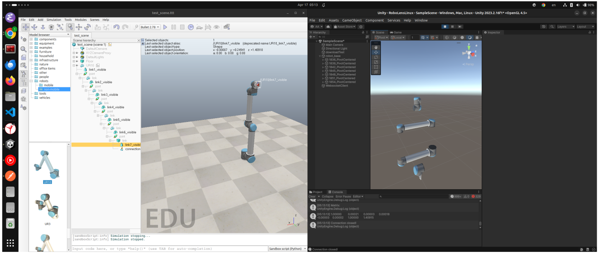
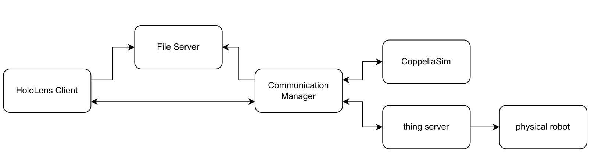
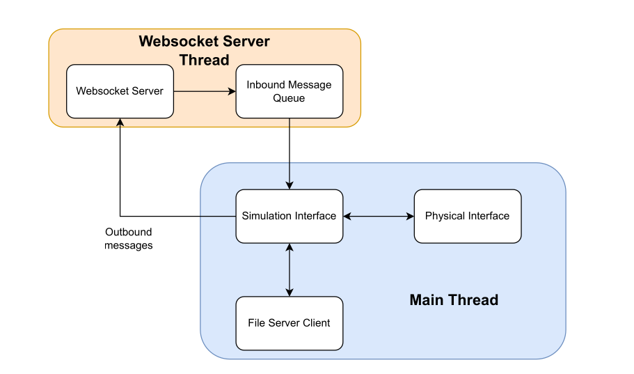
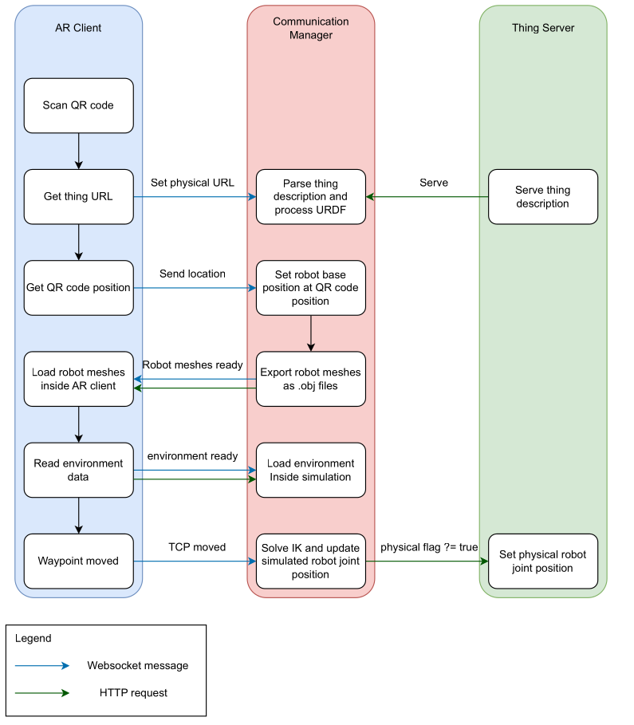
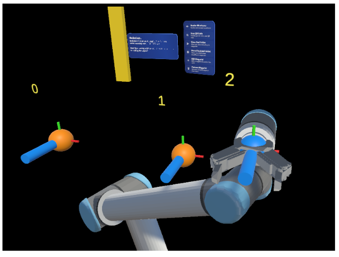
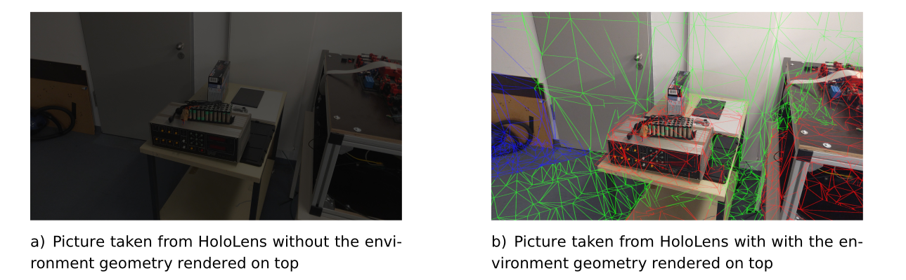

+++
title = "RoboLens, My Master's Thesis"
description = "RoboLens is a way to control robots using HoloLens based on WoT (Web of Things) protocols."
date = 2025-05-01
draft = false
slug = "robolens"

[taxonomies]
categories = ["projects"]
tags = ["robotics", "hololens", "wot", "unity", "projects", "python"]

[extra]
comments = true
lang = "pt"
image = "logo.png"
+++

# Before you read you can see a demo video of the project [here](https://www.youtube.com/watch?v=J-mDiHP6sMA) :)
 
 

# Bringing Robots to Life with Augmented Reality: My RoboLens Thesis Journey
 
Finally getting around writing about my Master's thesis **RoboLens: Visualization and Control of Web of Things Robotics using HoloLens**. It was a challenging, sometimes frustrating, but ultimately incredibly rewarding journey into the cutting edge of Augmented Reality (AR), Robotics, and the Web of Things (WoT). Here’s the story behind it.

### The Spark: Finding the Perfect Intersection

It all started, as many academic adventures do, with the search for a thesis topic. I was drawn to the potential of the Internet of Things (IoT) and Augmented Reality, two fields I throughly enjoy. Luckily, I stumbled upon an opportunity at the Professorship of Embedded Systems and Internet of Things at TU Munich that perfectly blended these interests.

The initial idea, sparked during discussions with my supervisor, [Fady Salama](https://www.linkedin.com/in/fady-salama-2158031a4/), was ambitious: could we control a robot intuitively using the Microsoft HoloLens 2 headset, and importantly, could we integrate this control system into the broader framework of the Web of Things? The goal was to move beyond traditional, often complex, robot programming methods and create something more visual, interactive, and standardized.

### Early Days: Reconnaissance and Roadblocks

With the direction set, I dove in. The early stages involved a lot of trial and error and reconnaissance missions exploring different tools and techniques.

One key decision was selecting the right simulation software. I landed on **CoppeliaSim** (formerly V REP). It's a powerful tool for physics simulation, scene editing, and crucially for my project, calculating inverse kinematics (figuring out the joint angles needed to reach a specific point) and detecting collisions. Interestingly, I ended up using CoppeliaSim in a "headless" mode – no graphical user interface – letting it run purely as a backend calculation engine. This kept the HoloLens focused on what it does best: visualizing and interacting with the augmented world.

A significant early hurdle emerged: how to get the robot's model into the HoloLens application (built with Unity) *while the application was running*. Robot models are often defined using the Unified Robot Description Format (URDF) – essentially an XML blueprint detailing the robot's geometry, links, and joints. Importing this complex structure directly into a live Unity scene proved tricky. The solution? A pipeline approach: import the URDF into CoppeliaSim first, which handled it easily, and then export the necessary mesh data from CoppeliaSim to the HoloLens/Unity client.

Beyond just importing models, ensuring the virtual robot in the HoloLens perfectly matched the simulated robot in CoppeliaSim required overcoming differences in how these platforms handle 3D space. CoppeliaSim uses a right handed coordinate system, while Unity uses a left handed one. This meant positions and rotations received from the simulation had to be mathematically converted before being applied in the AR view. Furthermore, the pivot points (the reference frame origin) of the robot's individual link meshes sometimes differed between the simulation and the imported models in Unity, requiring careful alignment to prevent visual inconsistencies.

*Figure 1: Side by side view showing the visual difference between the robot in CoppeliaSim (left) and its initial representation in Unity (right) before transformation corrections.*

### Building the System: Connecting the Pieces

With the simulation and visualization tools chosen, the next big challenge was making everything talk to each other in real time. The system architecture involved several key players:

1.  **HoloLens Client (RoboLens App):** The AR interface running on the HoloLens 2 for user interaction and visualization.
2.  **Communication Manager:** The central hub, coordinating communication between all other components.
3.  **CoppeliaSim:** The simulation engine handling physics, IK, and collision detection.
4.  **Thing Server:** Hosting the robot's "Thing Description" (TD) – a standardized WoT description of the robot's capabilities.
5.  **File Server:** Serving up files like the robot's 3D meshes via standard HTTP.
6.  **Physical Robot:** The actual UR10 robot arm executing commands in the real world.

*Figure 2: Overview of the RoboLens system architecture.*

The Communication Manager, acting as the central hub, had its own internal structure to handle incoming messages and coordinate actions:

*Figure 3: Internal architecture of the Communication Manager.*

The diagram below shows the initial communication flow when the system starts up, triggered by scanning a QR code:

*Figure 4: Communication flow between AR Client, Communication Manager, and Thing Server after a QR code is scanned.*

Getting these components to communicate smoothly was, frankly, a headache requiring lots of debugging! I primarily used **WebSockets** for the real time link between the HoloLens and the Communication Manager (handled via the WebSocket Server Thread shown in Figure 3). While more advanced techniques exist (like those used in multiplayer games), WebSockets served the purpose well for this research project. The Communication Manager talked to CoppeliaSim via its remote API (using ZeroMQ) and controlled the physical UR10 robot using the Real Time Data Exchange (RTDE) protocol via a Python Flask server acting as the WoT interface (managed within the Main Thread shown in Figure 3).

Thankfully, latency wasn't a major issue because the entire system ran on a local network – everything in the same room, connected to the same router.

### The User Experience: Intuitive Control with Waypoints

How does a user actually *control* the robot? I developed the user interface gradually. The core concept became a **waypoint system**.

Using the HoloLens, you could create virtual waypoints directly in your physical space. You'd simply pinch and drag to place these waypoints where you wanted the robot's tool (the end effector) to go. The waypoints show the target position and orientation, and are numbered to indicate the sequence of movement.

*Figure 5: Demonstrating multiple waypoints (0, 1, 2) placed in the AR environment to guide the robot.*

The system provided immediate feedback:

* **Real time Visualization:** You'd see the virtual robot model snap to the waypoint configuration.
* **Reachability Check:** Crucially, the system (using CoppeliaSim's IK calculations) would instantly check if the waypoint was actually reachable by the robot. If not, the waypoint would turn red, prompting you to adjust its position or orientation. This prevented sending impossible commands to the robot.
* **Environment Awareness:** The HoloLens constantly scans the physical environment, creating a 3D mesh. This mesh was sent to CoppeliaSim, allowing the simulation to detect potential collisions between the planned robot path and real world objects *before* the physical robot moved.

*Figure 6: The HoloLens view showing the scanned environment mesh (green wireframe) overlaid on the real world.*

* **Audio Cues:** I added sounds for confirmation (QR code scanned, robot moving) and warnings (waypoint unreachable, path error) to make the interaction even clearer.

Once you had a sequence of reachable waypoints defining a path, you could command either the simulated robot or the physical robot to execute the movement.

### Putting It to the Test: Real Users, Real Feedback

The real test came with the user study. I recruited 14 participants, most with little to no prior experience in robotics or AR. I asked them to perform tasks like guiding the robot along a C shaped path using the waypoint system.

The results were incredibly encouraging! Participants were able to learn the interface and control the robot intuitively and comfortably. Seeing people, regardless of their technical background, successfully program the robot using this AR interface was one of the most rewarding moments of the project.

Of course, it wasn't perfect. Some users found the HoloLens hand interactions (like pinching objects from afar) a bit jittery at times, and the IK solver occasionally marked seemingly reachable points as unreachable, causing some frustration. These "hiccups" provided valuable feedback for future improvements.

### Reflections: More Than Just a Thesis

Looking back, this thesis was more than just an academic requirement. After a Master's program that was often quite theoretical, diving deep into building RoboLens reignited my passion for hands on creation. It reminded me how enjoyable it is to tackle complex technical challenges, blend different technologies, and build something tangible (or, in this case, augmented!). It was a journey back to creativity and craftsmanship.

### What's Next for RoboLens?

The project demonstrated a viable and intuitive way to control WoT enabled robots using AR. There are many exciting avenues for future work, such as:

* Improving the environment scanning to better handle the physical robot's own geometry.
* Experimenting with different communication protocols (like UDP) for potentially lower latency on transformation data.
* Enhancing the waypoint system with features like saving/loading paths or associating specific actions (like gripping) with waypoints.
* Integrating RoboLens into broader WoT platforms to control a wider variety of devices alongside robots.

This project was a fantastic learning experience, pushing the boundaries of how we interact with robotic systems. It also lit the spark for having fun in building things back in me :). Especially after spending a lot of time in the theoretical world of my Master's program.

*You can see a demo video of the project [here](https://www.youtube.com/watch?v=J-mDiHP6sMA).*

Let me know what you think!

Finally, a huge thank you to my thesis supervisor, [Fady Salama](https://www.linkedin.com/in/fady-salama-2158031a4/), for his invaluable guidance and support throughout this project.

