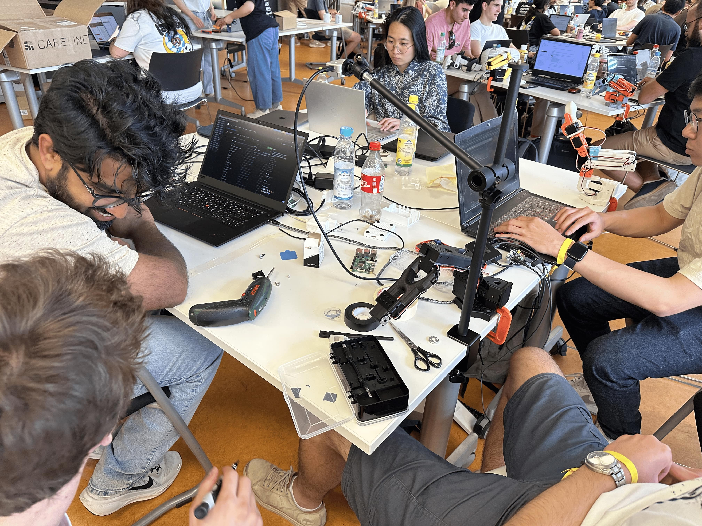

+++
title = "LeHelpingHand: Your Soldering Helper and Our Hugging Face Hackathon Journey"
description = "LeHelpingHand is a robotic helping hand for soldering, built during the Hugging Face AI Robotics Hackathon in Munich. This the story of how we used LeRobot and SmolVLA to create an intelligent robot that can grab and move printed circuit boards (PCBs)."
date = 2025-06-17
draft = false
slug = "lehelpinghand"

[taxonomies]
categories = ["projects", "hackathon"]
tags = ["robotics", "AI", "LeRobot", "SmolVLA", "projects", "hackathon"]

[extra]
comments = true
lang = "pt"
image = "logo.png"
+++

# ** From Zero to PCB Grabbing Robot: Our HuggingFace Hackathon Journey**

What an incredible weekend! I just got back from the Munich edition of the **Hugging Face AI Robotics Hackathon**, and my brain is still buzzing. Starting on Saturday morning and sprinting to the finish line by 3 PM on Sunday, my team and I set ourselves a challenge: could we build "LeHelpingHand," a robotic "helping hand" for soldering, one of the most common tasks in electronics?

Spoiler: we did! We went from receiving the robots to getting them to intelligently grab and move a printed circuit board (PCB). Here’s a little story of how it all came together.

### **Our Toolkit: The Magic of LeRobot and SmolVLA**

The real game changer for this hackathon was the set of tools we had at our disposal. For anyone into AI and robotics (like me, having studied it at TUM), this is where it gets really interesting.

**What is LeRobot?**

Think of **[LeRobot](https://huggingface.co/docs/lerobot/index)** as a toolbox and framework from Hugging Face designed to bridge the gap between powerful AI models and real-world robots. In the past, getting an AI to control a physical robot was a huge pain. LeRobot helps standardize this, providing a framework and pre-trained models that make it way easier to get started. It’s an open-source project aimed at lowering the barrier to entry, which is exactly what you need for a hackathon on a tight schedule.

**And what's a "SmolVLA"?**

This was the "brain" of our robot. **[SmolVLA](https://huggingface.co/blog/smolvla)** stands for "Small Vision-Language-Action" model. Let's break that down:

* **Vision:** It sees the world through a camera.
* **Language:** It can understand instructions or context.
* **Action:** It decides what physical action the robot should take.

The key here is "Smol" (as in, small). Unlike massive AI models that require huge servers, SmolVLA is designed to be efficient. It’s a compact, 450M-parameter model that can be "fine-tuned" with a relatively small amount of new data. This meant we could actually train it on our specific task right there at the hackathon, using a single GPU in the cloud.

### **The Process: An Intense Weekend Blur**

With our tools chosen, the race was on. The weekend was a blur of building, coding, and debugging.

**Step 1: The Idea and the Teleop Demo**

First, we had to prove our concept. We wanted a robot that could assist in soldering by holding and moving a PCB. We did this using a two-robot setup for what's called "imitation learning." We controlled a 'leader' arm, and a 'follower' arm mirrored its movements, allowing us to perform the task through 'teleoperation' (basically, controlling the robot like a puppet). This let us demonstrate the idea and feel out the movements we needed to record.

{{ youtube(id="fxFjPvBCGho") }}

**Step 2: Time to Gather Some Data**

With our teleoperation setup working, it was time to create the dataset. Using the leader-follower system, we manually performed the PCB-grabbing task over and over. The system recorded everything from the follower robot's camera perspective and the precise actions it was mirroring from our control. This data (the video feed paired with our control actions) is what we'd use to train the model. Every successful grab was a precious data point.

**Step 3: Fine-Tuning the Brain**

Once we had our dataset, it was time to teach SmolVLA. We uploaded our data and used Google Colab with a powerful A100 GPU to run the fine-tuning process. This is where the magic happens: the pre-trained SmolVLA model, which already has a general understanding of the world, adapts to our specific task of grabbing a PCB. In a surprisingly short amount of time (a couple of hours), the training was complete.

**Step 4: The Moment of Truth**

This is the best part of any robotics project. We loaded our newly fine-tuned model onto the robot, placed the PCB on the table, and ran the code. Seeing the robot move on its own, identify the PCB, and successfully pick it up based on the brain *we* had just trained was an absolutely amazing feeling.
{{ youtube(id="tDCzGx3gOLQ") }}

### **The Grand Finale and Our Takeaways**

We packaged everything into our final submission video, proud of what we'd built in a single, intense weekend.

{{ youtube(id="tEURpR9qA3Q") }}

The experience was incredible. It’s amazing how accessible these powerful AI tools are becoming, allowing a small team to build an intelligent robot in such a short amount of time. It was a weekend of intense problem-solving, learning, and fantastic teamwork.

A huge shout-out to my incredible teammates ([Nicola](https://www.linkedin.com/in/nicolaloi/), [Steven](https://www.linkedin.com/in/stevenhansel/), [Nirmal](https://www.linkedin.com/in/nirmal-kumar-ramadoss-b9367a25a/)  and [Autumn](https://www.linkedin.com/in/autumn-hong-696428187/)) and to the organizers for putting on such a great event here in Munich.

