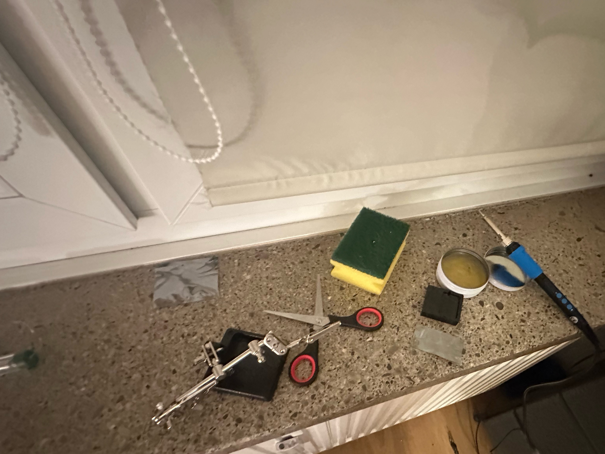
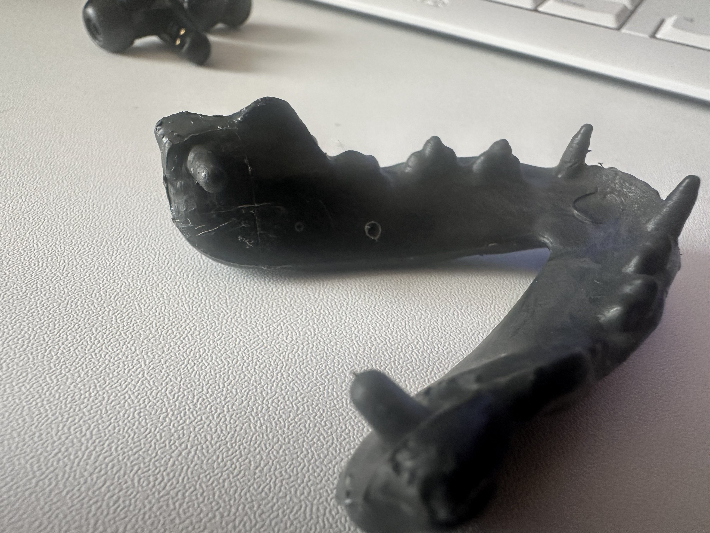

+++
title = "I Built a Talking Cat with NodeMCU"
description = "A project about a talking cat I built with nodemcu, speakers and a servo."
date = 2025-11-20
slug = "talking-cat"

[taxonomies]
categories = ["projects"]
tags = ["nodemcu", "iot", "projects", "showing off"]

[extra]
comments = true
lang = "en"
image = "skeleton_on_couch.png" 
+++

# I built a talking cat!
While walking around Gieselarstr. in Munich and passing flying tiger something caugth my eye, a cat skeleton being sold as hallowing decoration. Looking closer at it, it seemed to have a mouth that could be opened and closed and a movable head. Looking at it, it was begging for more life to be put into it. So I bought it and started thinking about how to make it talk.

## Components
Thought I'd get this out of the way first, the components that I ended up using for this project in the end:
* **Microcontroller:** diymore ESP32 NodeMCU Module (USB-C)
* **Audio:** AZDelivery 3 Watt 8 Ohm Portable Mini Speakers
* **Servo:** Miuzei 9G Micro Servo Motor
* **DAC/Amp:** AZDelivery MAX98357A I2S 3W Mono Amplifier
* **Wiring:** Elegoo 120pcs Multicolored Dupont Jumper Wires
* **Power:** USB Power Bank
* **Skeleton:** Cat Skeleton from Flying Tiger
* **Adhesive:** 2-part epoxy glue
* **Misc:** Zip Ties, Tape, Miuzei Basic Starter Kit (for breadboard/prototyping)

## Fooling around
I started with the electronics sprawled out on my desk. It was your standard "breadboard spaghetti" situation. My goal was simple: play audio from my phone via Bluetooth and have the servo move the jaw.

Getting the audio to play was surprisingly straightforward. I wired up the MAX98357A amp to the ESP32’s I2S pins, connected the speaker, and boom, I had a very janky Bluetooth speaker. The real headache was the synchronization.

This step also involved me soldering the pins on the MAX98357A since the breakout board I had didn't have any headers soldered on it 🥲. I didn't really have a soldering station at home, just a soldering iron. Felt like building iron man in a cave scene here 


### Attempt 1: The "Robotic" Approach
My first thought was to just check if music was playing or not. I found a library example that used the Bluetooth AVRCP protocol (basically how your headphones tell your phone to pause). I tweaked the code so that when the status changed to `PLAYING`, the servo opened, and when it stopped, it closed.

```cpp
// logic: if music is on, open mouth. if off, close mouth
if (state == ESP_A2D_AUDIO_STATE_STARTED) {
    mouthServo.write(MOUTH_OPEN);
} else {
    mouthServo.write(MOUTH_CLOSED);
}
```

It worked, but it looked terrible. The cat looked like it was screaming with its mouth wide open for the entire song, then slamming it shut at the end. I needed something that actually reacted to the *sound*.

### Attempt 2: Analyzing the Waveform
I switched gears and moved to the [ESP32-A2DP](https://github.com/pschatzmann/ESP32-A2DP) and [AudioTools](https://github.com/pschatzmann/arduino-audio-tools) libraries. These are powerful but a bit picky, so I spent a good afternoon fighting compilation errors just to get the include order right.

Once it compiled, I set up a "stream reader." Instead of just piping audio to the speaker, I intercepted the raw data first. I wrote a small function to find the loudest "peak" in the audio wave and mapped that volume to the servo angle. Loud sound means the mouth opens wide, quiet sound means the mouth stays closed.

```c++
void read_audio_data(const uint8_t *data, uint32_t length) {
  // find the loudest sample in this batch of audio
  int16_t* samples = (int16_t*)data;
  for (int i = 0; i < length/2; i++) {
     if (abs(samples[i]) > current_peak) {
        current_peak = abs(samples[i]);
     }
  }
}
```

It looked much better, for about five seconds.

### Attempt 3: The Stuttering Nightmare
Suddenly, the audio started glitching and stuttering. It sounded like a corrupted robot. The problem was that analyzing the audio and moving the servo (which uses `delay()`) takes time. The ESP32 was so busy moving the motor that it couldn't feed audio data to the amplifier fast enough, causing the buffer to run dry.
{{ youtube(id="ibPCroP2rSs") }}

### The Fix: Multithreading
I remembered the ESP32 is a dual-core microcontroller (I think it said somewhere in the Amazon description when I bought it). By default, Arduino jams everything onto one core.

After a little chat with gemini, I ended up using **FreeRTOS** (the operating system running under the hood of the ESP32) to split the brain:
* **Core 1:** Dedicated 100% to handling the Bluetooth audio stream.
* **Core 0:** Ran a separate task just for the servo math and movement.

```c++
// pin the servo logic to core 0 so core 1 is free for audio
xTaskCreatePinnedToCore(
      servo_task,       /* function to implement the task */
      "ServoTask",      /* name of the task */
      10000,            /* stack size in words */
      NULL,             /* task input parameter */
      1,                /* priority of the task */
      &servoTaskHandle, /* task handle. */
      0);               /* core where the task should run (0) */
```

Once I pinned the tasks to separate cores, the stutter vanished instantly. The setup could finally output smooth noise.
{{ youtube(id="tQ8SOMY6JGc") }}

## Skeleton Surgery
now that I had the electronics working, I had to figure out how to fit them into the skeleton and make the mouth move when audio is played. I started with trying to see what the best way to move the jaw was. Fiddling around, I figured that a paperclip bent into a hook shape was actually ideal since it was flexible engough for me to put into shape and strong enough to move the jaw without bending. 

I thought that making a whole in the jaw and passing the paperclip through it would be the best way to connect the servo to the jaw. After some trial (and not having a drill), I realized that this wasn't such a good idea.  Thinking a bit more and looking at the stuff that I had laying around (yes it was messy at my place then 😅). I realized that the paperclip fit very snug inside the opening in the zip ties I had lying around. This changed the problem from drilling a hole in the jaw to figuring out a way to glue the zip tie onto the jaw which turned out much simpler given that I had a set of 2 part epoxy also laying around. 
{{ youtube(id="i6NJEtw41DQ") }} 
After the epoxy dried I could move it but I realized the head swivel was a bit annoying when moving and made things slip when it rotated {{ youtube(id="S20OLJxf2OA") }}. 
So I ended up adding some epoxy on it too to stop it from moving. A bit of cabling later and this is how it looked like {{ youtube(id="sK52k0PhnD4") }}
With the halloween party starting in a couple hours, I didn't have time for cleaner wiring so I just slapped a black cloth on top and called it a day

## Final Video
{{ youtube(id="iIqy-yb8aNA") }}

## Code
Here is the final code that runs on the skeleton. It uses the `ESP32-A2DP` and `AudioTools` libraries to handle the heavy lifting of the audio stream, while I use FreeRTOS to split the workload between the two CPU cores.


```c++
#include <AudioTools.h>
#include <ESP32Servo.h>
#include <BluetoothA2DPSink.h>

// servo settings
#define SERVO_PIN GPIO_NUM_13   
#define MOUTH_CLOSED_POS 90     
#define MOUTH_OPEN_POS 130      

// audio tuning
// anything below this is considered silence
#define AUDIO_THRESHOLD 1500
// max loudness to map to. lower this to make the mouth open wider
#define AUDIO_MAX_LOUDNESS 25000 

Servo mouthServo;
I2SStream i2s; 
BluetoothA2DPSink a2d_sink(i2s); 

volatile int32_t peak_level = 0;
TaskHandle_t servoTaskHandle; 

// audio callback (runs on core 1)
// we just grab the volume peak here, don't do heavy math
void read_audio_data(const uint8_t *data, uint32_t length) {
  int32_t max_sample = 0;
  int16_t* samples = (int16_t*)data;
  int num_samples = length / 2; 

  for (int i = 0; i < num_samples; i++) {
    int32_t sample_abs = abs(samples[i]);
    if (sample_abs > max_sample) {
      max_sample = sample_abs;
    }
  }

  // update the shared variable
  if (max_sample > peak_level) {
    peak_level = max_sample;
  }
}

// servo task (runs on core 0)
// handles all the movement logic without blocking the audio
void servo_task(void *pvParameters) {
  for(;;) { 
    
    int32_t current_peak = peak_level;

    // decay the peak level so the mouth closes smoothly
    // using bitwise math for speed
    peak_level = (peak_level * 3) >> 2; 

    int servoAngle;

    if (current_peak > AUDIO_THRESHOLD) {
      // map volume to angle
      servoAngle = map(current_peak, AUDIO_THRESHOLD, AUDIO_MAX_LOUDNESS, MOUTH_CLOSED_POS, MOUTH_OPEN_POS);
    } else {
      // close mouth if silent
      servoAngle = MOUTH_CLOSED_POS;
    }

    servoAngle = constrain(servoAngle, MOUTH_CLOSED_POS, MOUTH_OPEN_POS);
    mouthServo.write(servoAngle);

    // important: let the os switch tasks
    vTaskDelay(20 / portTICK_PERIOD_MS); 
  }
}

void setup() {
  Serial.begin(115200);

  // setup servo timers
  ESP32PWM::allocateTimer(0);
  ESP32PWM::allocateTimer(1);
  ESP32PWM::allocateTimer(2);
  ESP32PWM::allocateTimer(3);
  mouthServo.setPeriodHertz(50); 
  mouthServo.attach(SERVO_PIN, 500, 2400); 
  mouthServo.write(MOUTH_CLOSED_POS);      

  // setup i2s audio
  auto cfg = i2s.defaultConfig();
  cfg.pin_bck = GPIO_NUM_25;
  cfg.pin_ws = GPIO_NUM_26;
  cfg.pin_data = GPIO_NUM_27;
  i2s.begin(cfg);

  // attach the audio reader
  a2d_sink.set_stream_reader(read_audio_data);
  a2d_sink.start("Kitten Speaker"); 

  // launch the servo task on core 0
  xTaskCreatePinnedToCore(
      servo_task,      
      "ServoTask",     
      10000,           
      NULL,            
      1,               
      &servoTaskHandle, 
      0);              
}

void loop() {
  // core 1 is busy with audio, so we leave this empty
  vTaskDelay(1000 / portTICK_PERIOD_MS); 
}
```