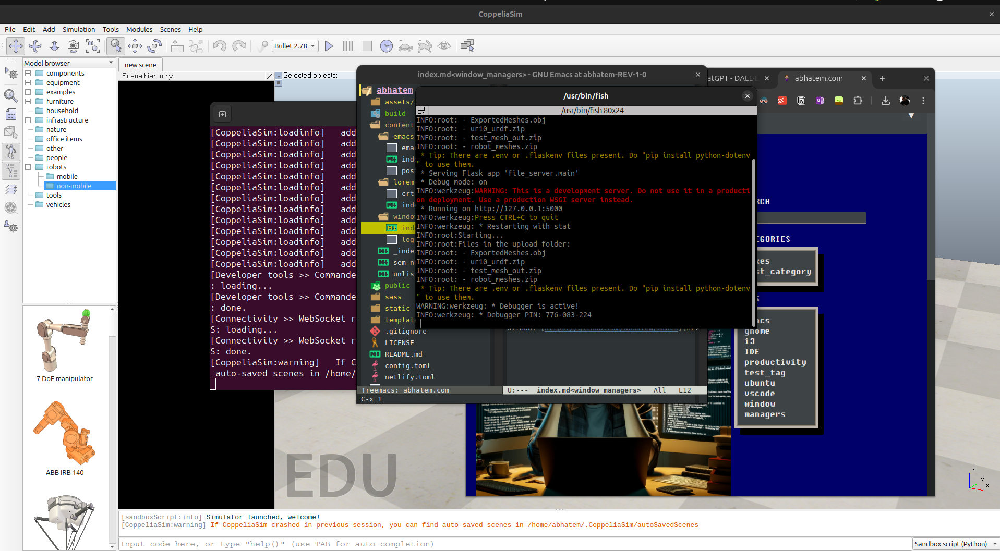
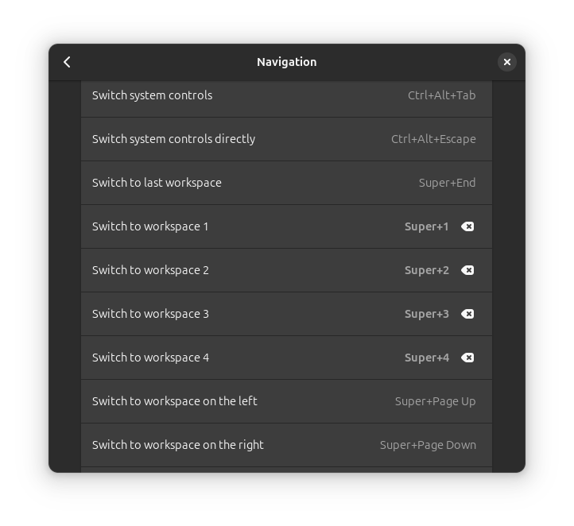

+++
title = "A quick trip through i3 and back"
description = "Do I really need a tiling window manager, or do I just want the street cred that comes from using one?"
date = 2024-05-15
draft = false
slug = "window_managers"

[taxonomies]
categories = ["takes"]
tags = ["window managers", "gnome", "i3", "ubuntu"]

[extra]
comments = true
lang = "pt"
image = "logo.png"
+++

On warm tuesday evening when I was playing around with a project that requires at least 6 windows open from different programs to run. I realized I needed a new way to deal with all the mess that comes with that. Which made go into a small rabbit of shortcuts, gnome workspaces and finaly tiling window managers. 

My lazy approach was first to use gnome workspaces and split each window and any realted programs (e.g. terminal running some commands or chrome for googling soem stuff) on the same workspace I a lotted to it. and switching workspaces with gnome's default key bindings `ctrl+alt+left/right arrow` (at least that's what they are on ubuntu). 

this looked something like this, which gave me some clarity while trying to navigate the window bush I have (yes that's what I call it)

after a while I realized that I was still doing a lot of manual work to get the windows to the right workspace and that I was still using the mouse a lot. which is not what I wanted. I wanted to be able to do everything with the keyboard. So I ended up experimenting with i3.

I3 is a tiling window manager that is very keyboard centric. It's a bit of a learning curve to get used to it, but once you get the hang of it, it's very powerful. At least that's what I understood from the internet. But after going through [Fawzan Fawzi's i3 setup guide](https://www.youtube.com/playlist?list=PL0rXAycsylvXxyPDT5kGQ5MiHcqrZWv69), I realized that it is way too complicated especially given the fact that you have to set up the whole desktop environemnt from scratch and not just the interaction with the windows. This includes stuff like working with the bluetooth manager on a command line level, and setting up not only the desktop background but the command line tool that is supposed to display it. 

All of this lead me to thinking whether I really need it or would I be happy just by finding a way to quickly switch between workspaces and windows in good old gnome. I was actually happy with gnome but after my i3 journy I realized the ability to through windows around with the keyboard and working accross multiple workspaces could make the experience of working accross multiple applications that much simpler. 

Which lead me to try out and see how easy I could get the same functionality in gnome. And noticed that gnome does actually have the ability to simply switch between workspaces, in a way that actually seems to be inspired by i3 (my guess). 

The problem here, is that it can only support up to 4 workspaces. Which is not enough for me. So I went on a small hunt to find out how to switch to workspaces 5 and above. And found a solution that works for me. Namely by following the post here [Gnome 3 and switch to workspace 5 and above shortcut](https://www.hutsky.cz/blog/2021/05/gnome-3-and-switch-to-workspace-5-and-above-shortcut/), I found a setup that I can be very happy with, and in which it is easy to push windows that are non essential to workspace 0 for example, where they would be well hidden, and still have the ability to easily navigate back to any other workspace just through <super>+<number> keybindings. The final result looked something like this:

So in the end I realized that I don't really need a tiling window manager, but I do need a way to quickly switch between workspaces and windows. And that I can get that in gnome with a little bit of tweaking.

